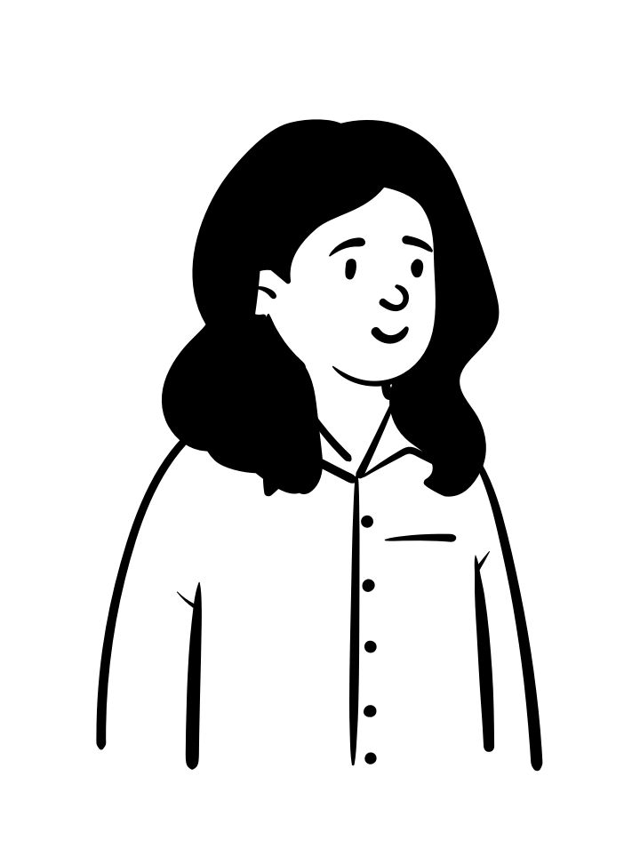
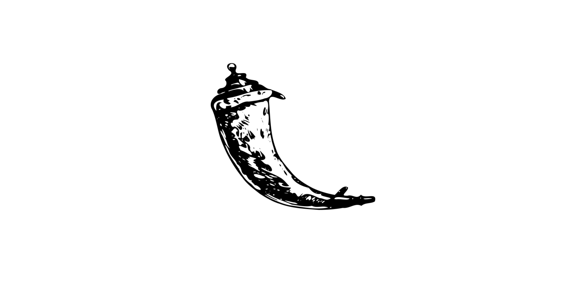
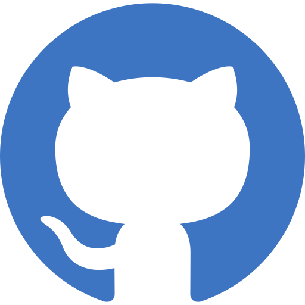

 
<h1 align="left"> I'm Elin </h1> 

<h2 align="left">   I'm a junior software developer interested in front end and user focused design with 10 years management experience</h2>

👩‍💻 I'm currently immersed in a 16 week professional software development course at CodeClan (a digital skills academy based in Scotland) which has taught me to celebrate small wins, how much you can learn (and forget) in a short time and that errors are your friend!

:telescope: I'm learning Python, Javascript and Java

:seedling: Striving to become a better programmer and keep solving problems

💙 CSS, HTML and React

🇸🇪 Originally from Sweden, stopped off in 🇮🇸 Iceland for a few years and now reside in 🏴󠁧󠁢󠁳󠁣󠁴󠁿 bonnie Scotland

<!--  -->

---

### Connect with me 
 

   &nbsp;&nbsp;&nbsp;
   

---

<h3>Languages and Tools</h3>

 
 

---

<h3>📌 Pinned Projects</h3>
 

## Erik: Educational Support App (group)

### [Go to Repository](https://github.com/ElinVS/Educational_aid)
* JavaScript
* Node.js
* React.js
* React Router
* MongoDB
* CSS
* HTML
 

## Pet Buddy: Vet Management App (solo)

    

### [Go to Repository](https://github.com/ElinVS/vet_management_project)
* Python
* Flask
* Jinja 
* PostgreSQL
* Psycopg
* HTML
* CSS

## Rock Paper Scissors: Online version of the classic game (solo)

    

### [Go to Repository](https://github.com/ElinVS/Rock_Paper_Scissors)
* Python
* Flask
* HTML
* CSS

---

 
<h3>GitHub Stats</h3>

  
   

 

