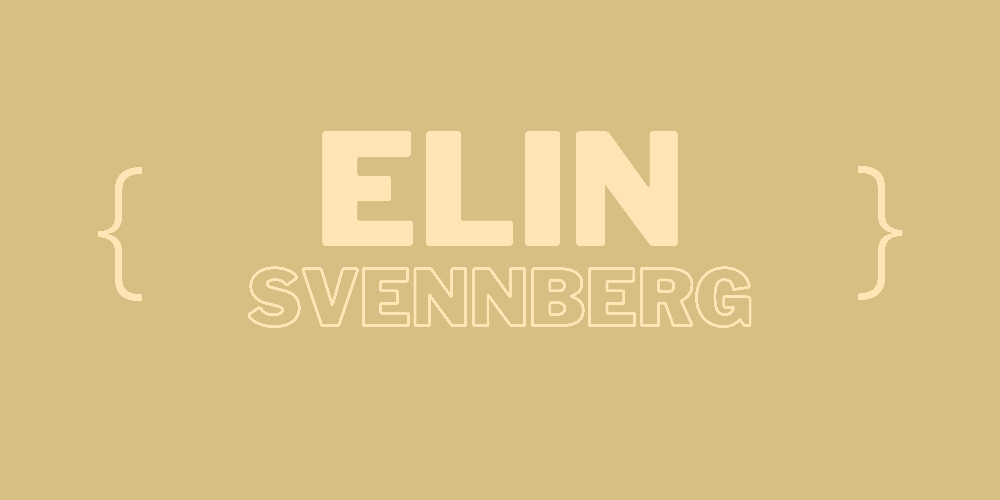

 
<h1 align="left"> Hey, I'm Elin 👋 </h1>
 
<h2 align="left">  I'm a junior software developer who is interested in front end and user focused design. Enthusiast of simple things and clean code. Happy to be here! </h2>

👩‍💻 I'm currently immersed in a 16 week professional software development course at CodeClan (a digital skills academy based in Scotland) which has taught me to celebrate small wins, how much you can learn (and forget) in a short time and that errors are your friend!

:telescope: I'm currently learning Python, Javascript and Java

:seedling: Striving to become a better programmer and keep solving problems

💙 CSS, HTML and React

### Connect with me 
 
 

   
   

### Languages and Tools 

 
 

 
 
<h3>GitHub Stats</h3>

  
 
   
 

